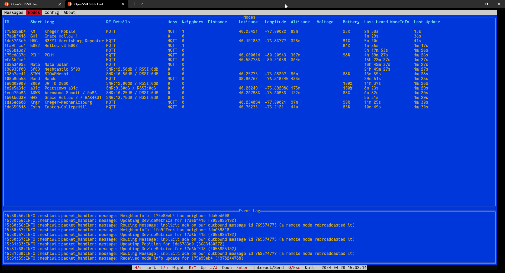

# meshtui
A console-based Text-User-Interface (TUI) for Meshtastic.

`meshtui` allows you to connect either via serial port, or by ip address, to your meshtastic hardware and visualizes the information received.

